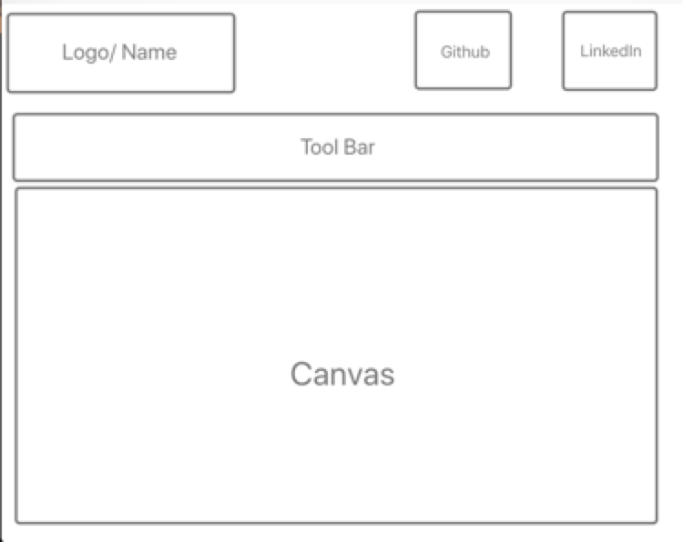

# drawFun

## ­Background

Sketching with AI is an interactive sketch tool where users can start drawing on the canvas and AI will finish the sketch. The goal of the project is to provide a powerful and user-friendly drawing web application where users can draw freely. In addition to that, there will be an AI that draws based on the user’s sketch, making the tool more educational and fun to use.

## Functionality and MVP

- Users can sketch with an assortment of drawing tools on the canvas.
- Users can see the AI finishing the drawing.
- Users can share/save the drawing.
- Bonus: Users can let the AI identify their drawings.

## Wireframe

## Technologies

TensorFlow JS and Magenta JS: Using pre-trained model provided by the library for AI drawing.

## Implementation Timeline

Day 1: All necessary setup and skeleton for user interface.

Day 2: Support user sketching with an assortment of drawing tools.

Day 3: Integrate with TensorFlow JS and Magenta JS’s API and render AI sketches.

Day 4: Create working save function. Add more drawing tools.

Bonus: Upon finishing the above features, explore custom-training AI model that can identify drawings.
